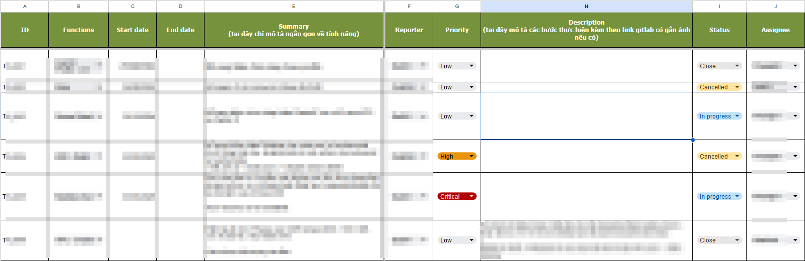
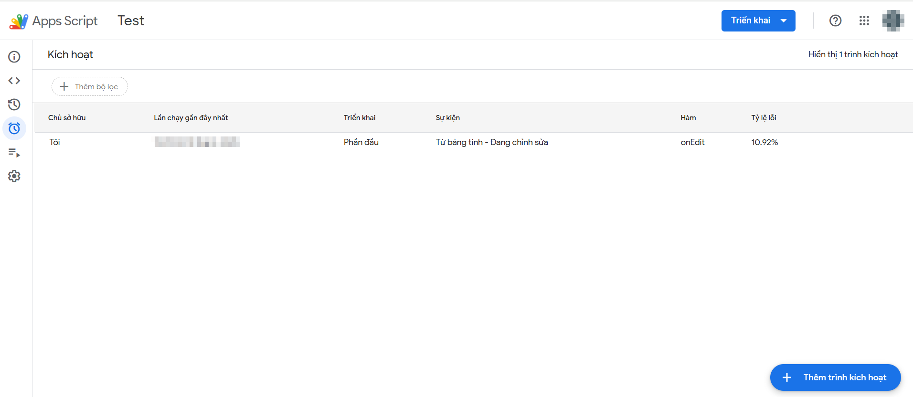
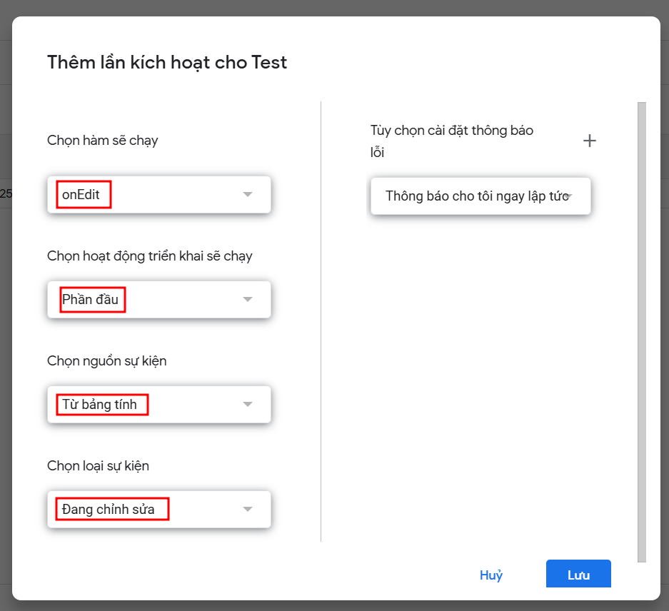
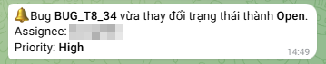

## Hướng dẫn liên kết thay đổi state của sheet bug bắn noti sang phía telegram bot
**1. Mục tiêu**: Google sheet là một công cụ hỗ trợ quản lý những log bug cho tester hiệu quả và chuyên nghiệp. Tuy nhiên, việc quản lý trạng thái của những bug đó mất khá nhiều thời gian và công sức. Do đó, chúng tôi muốn tìm ra một phương pháp quản lý thông minh, đáp ứng cả nhu cầu cảnh báo cho sheet bug. Chúng tôi lựa chọn tìm hiểu và liên kết giữa telegram với google sheet, nhằm đáp ứng nhu cầu trên và bên cạnh đó cũng gửi thông báo trạng thái của bug khi thay đổi đến người dùng

**2. Công cụ hỗ trợ**
- Telegram
- Google sheet

**3. Bài toán ví dụ**
- Một sheet có nhiều log bug, yêu cầu rằng khi thay đổi status ở cột I, thì sẽ bắn thông báo về phía telegram thông tin bao gồm (bug ID, status, assignee và priority)

**4. Các bước thực hiện**
- ***Bước 1***: Config Tele
    + Tạo bot tele: truy cập vào @BotFather
    + Lấy thông tin bao gồm: Chat id, Token của bot tele
- ***Bước 2***: Chuẩn bị script trên Google sheet
    + Truy cập vào sheet bạn để dữ liệu: chia cột dữ liệu rõ ràng
    + Xác định nội dung bạn thay đổi sẽ chuyển tiếp vào tele. Ví dụ tôi muốn khi thay đổi cột "state" nó sẽ update trạng thái tự động vào tele.
        
    + Thực hiện đoạn code để có thể chuyển đổi thông báo sang tele. Code tham khảo tại file [``Hướng dẫn code``](NotiTele.js). Bấm lưu file
    + Lưu ý: Để vào được mục script vui lòng truy cập như sau: Tiện ích -> App Script
- ***Bước 3***: Cấp quyền trigger
    + Chạy run lần đầu để cho phép quyền với hàm **onEdit**
    + Vào **Kích hoạt** và ấn **Thêm trình kích hoạt**
        
    + Khi popup mở ra lựa chọn nội dung như sau: Chọn hàm sẽ chạy (onEdit), Chọn hoạt động triển khai sẽ chạy (Phần đầu), Chọn nguồn sự kiện (Từ bảng tính), Chọn loại sự kiện (Đang chỉnh sửa), riêng thông báo bạn có thể lựa chọn tùy theo nhu cầu muốn nhận thông báo khi nào, ngay lập tức hoặc 1 khoảng thời gian. 
        
    + Bấm Lưu để tiến hành lưu kích hoạt.

=> Kết quả: Bạn sẽ chuyển đổi những thay đổi sang phía tele, gọi là cảnh báo (Noti)

